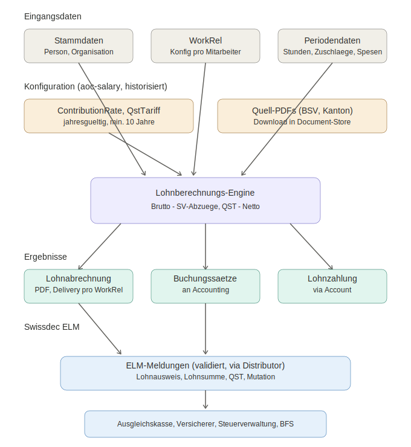

# Spezifikation: Lohnbuchhaltung (Swissdec-kompatibel)

| | |
|---|---|
| **Modul** | `salary` (in `finance`) |
| **Admin/Backoffice-Page** | `aoc-salary` |
| **Status** | Draft |
| **Version** | 1.1 |
| **Datum** | 2026-05-28 |
| **Standard** | Swissdec ELM 6.0 |

---

## 1. Zweck und Geltungsbereich

Diese Spezifikation beschreibt eine Schweizer Lohnbuchhaltung, die das Swissdec-Lohnstandard (ELM) erfüllt. Sie deckt Monatslöhne (Festanstellung) und Stundenlöhne ab, berechnet sämtliche Sozialversicherungsabzüge sowie die Quellensteuer für ausländische Mitarbeitende und erzeugt die gesetzlich vorgeschriebenen Meldungen und Belege (Lohnabrechnung, Lohnausweis Form 11, Lohnsummen- und Mutationsmeldungen).

Die Lösung baut auf bestehenden Kern-Entitäten auf (`Person`, `Organisation`, `Account`, `Accounting`) und nutzt die Beziehung `WorkRel` als zentralen Träger der mitarbeiterspezifischen Konfiguration.

Das Modul heisst `salary` und ist im Bereich `finance` angesiedelt. `aoc-salary` ist ausschliesslich die Admin-/Backoffice-Page des Moduls (Verwaltungsfunktionen, siehe 4.4); die eigentliche Lohnverarbeitung (Engine, Meldungen) liegt im Modul `salary` selbst.

### 1.1 Abgrenzung

Nicht Teil dieser Spezifikation sind: Zeiterfassungs-Hardware, HR-Recruiting, Spesenrichtlinien-Definition (nur deren Abrechnung), sowie die Finanzbuchhaltung selbst (es werden lediglich Buchungs-Datensätze über `finance/booking` erzeugt, siehe 4.8).

---

## 2. Begriffe und Abkürzungen

| Abkürzung | Bedeutung |
|---|---|
| AHV | Alters- und Hinterlassenenversicherung |
| IV | Invalidenversicherung |
| EO | Erwerbsersatzordnung |
| ALV | Arbeitslosenversicherung |
| BU / NBU | Berufsunfall / Nichtberufsunfall (UVG) |
| BVG | Berufliche Vorsorge (2. Säule) |
| KTG | Krankentaggeldversicherung |
| FAK | Familienausgleichskasse (Familienzulagen) |
| QST | Quellensteuer |
| ELM | Einheitliches Lohnmeldeverfahren (Swissdec), Version 6.0 |
| Form 11 | Offizieller Lohnausweis |
| WorkRel | Arbeitsverhältnis-Relationship zwischen Person und Organisation |
| PersonalRel | Persönliche Beziehung zwischen zwei Personen (z. B. Typ `ParentChild`) |
| swisscities | Referenzdatenquelle PLZ → Ort/Kanton (Schweizer Ortschaften) |

---

## 3. Business Requirements

### 3.1 Swissdec-Kompatibilität (BR-01)

Das System MUSS gemäss dem Swissdec-Lohnstandard **ELM Version 6.0** implementiert sein. Konkret:

- Erzeugung von ELM-konformen XML-Meldungen (Lohnausweis, AHV-Lohnsumme, ALV, UVG, UVGZ, KTG, BVG, FAK, Quellensteuer, Statistik BFS).
- Verteilverfahren (Distributor) für die Übermittlung an mehrere Empfänger (Ausgleichskasse, Versicherer, Steuerverwaltungen, BFS) aus einer Meldung.
- Unterstützung des PIV (Payroll-Insurance-Verfahren) und EIV (Enterprise-Insurance-Verfahren) sofern relevant.
- Validierung der erzeugten XML gegen die offiziellen Swissdec-Schemata (XSD) vor Versand.

### 3.2 Beitragssatz-Konfiguration mit Historisierung (BR-02)

- Jährliche Konfiguration aller Beitragssätze (siehe 3.3).
- Mindestens **10 Jahre** rückwirkend historisiert; jede Rate trägt einen Gültigkeitszeitraum (`validFrom` / `validTo`).
- Eine Lohnberechnung MUSS immer die zur Lohnperiode gültige Rate verwenden (zeitpunktbezogene Auflösung), auch bei rückwirkenden Korrekturen vergangener Perioden.
- Sätze können kassen-/versicherer-/kantonsabhängig sein und werden entsprechend zugeordnet (siehe Datenmodell `ContributionRate`).

### 3.3 Sozialversicherungsabzüge (BR-03)

Für jeden Beitrag werden Arbeitnehmer- (AN) und Arbeitgeberanteil (AG) getrennt berechnet und gebucht.

| Beitrag | AN-Anteil | AG-Anteil | Bemessungsgrundlage / Besonderheit |
|---|---|---|---|
| AHV/IV/EO | ja | ja | Bruttolohn AHV-pflichtig; Rentnerfreibetrag berücksichtigen |
| ALV | ja | ja | bis Höchstlohn; darüber kein Abzug |
| BU (Berufsunfall) | nein | ja | nach Risikoklasse Versicherer |
| NBU (Nichtberufsunfall) | ja (i.d.R.) | konfigurierbar | bis UVG-Höchstlohn |
| BVG | ja | ja | altersabhängig, Koordinationsabzug, versicherter Lohn |
| KTG | konfigurierbar | konfigurierbar | je Vertrag, AN/AG-Split konfigurierbar |
| FAK | nein | ja | kantonal; Verwaltungskosten inkl. |

Anforderungen:
- Höchstlohngrenzen (ALV, UVG) und Freibeträge MÜSSEN aus der jahresgültigen Konfiguration stammen.
- BVG-Beiträge MÜSSEN den Koordinationsabzug und die altersabhängigen Sätze berücksichtigen; versicherter Lohn wird pro Person aus dem Vorsorgeplan abgeleitet.
- Rundungsregeln gemäss Swissdec (Rappenrundung) MÜSSEN angewendet werden.

### 3.4 Quellensteuer (BR-04)

- Berechnung für ausländische Mitarbeitende ohne Niederlassungsbewilligung C sowie Grenzgänger.
- Tarifauflösung nach Kanton, Tarifcode (Zivilstand, Kinder, Konfession, Nebenerwerb). Der Kanton wird aus der favorisierten Postadresse der `Person` abgeleitet (PLZ → `swisscities` → Kanton, siehe 8.3).
- Monats- vs. Jahresmodell je nach Kanton.
- Quellensteuermeldung nach Swissdec (ELM-QST) an die zuständige kantonale Steuerverwaltung.
- Tarife sind Teil der jahres-/monatsgültigen, historisierten Konfiguration (kantonsbezogen).
- Korrekturen / Aufrollung (Tarifwechsel rückwirkend) MÜSSEN unterstützt werden.

### 3.5 Festanstellung — Monatslohn (BR-05)

- Fixer Monatslohn pro `WorkRel`.
- 13. Monatslohn **optional**; Auszahlungsmodus konfigurierbar (einmalig Dezember, hälftig Juni/Dezember, pro rata bei Ein-/Austritt).
- Familien-/Kinderzulagen gemäss kantonalem FAK-Recht. Anzahl Kinder inkl. Geburtsdatum werden **nicht** auf der `WorkRel` dupliziert, sondern über die `PersonalRel` vom Typ `ParentChild` der Mitarbeiter-`Person` gelesen (jedes Kind ist eine eigene `Person` mit eigenem Geburtsdatum). Die Anspruchsart/-höhe pro Kind wird auf der `WorkRel` referenziert (siehe `childAllowances`).
- Ferien- und Feiertagsregelung im Monatslohn enthalten (kein separater Zuschlag), Ferienanspruch dokumentiert.
- Lohnfortzahlung bei Krankheit/Unfall (Skala konfigurierbar: Bern/Basel/Zürich).

### 3.6 Stundenlohn (BR-06)

- Erfassung **effektiver Arbeitsstunden** pro Periode.
- Ferienentschädigung: Prozentsatz **konfigurierbar** (z. B. 8.33 % bei 4 Wochen, 10.64 % bei 5 Wochen).
- Feiertagsentschädigung **optional**, Prozentsatz konfigurierbar (kantonsabhängig).
- 13.-Monatslohn-Zuschlag **optional** (z. B. 8.33 %).
- Zuschläge (Überstunden, Nacht-, Sonntags-, Schichtarbeit) konfigurierbar als Faktor oder Prozentsatz.

### 3.7 Spesenabrechnung (BR-07)

- Pauschalspesen (fixer Betrag pro Periode, i.d.R. nicht AHV-pflichtig sofern Spesenreglement genehmigt).
- Effektive Spesen (Einzelbelege, Betrag pro Abrechnung).
- Spesen werden auf dem Lohnausweis (Form 11) korrekt ausgewiesen (Ziffern 13.1/13.2).

### 3.8 Lohnabrechnung pro Mitarbeitenden (BR-08)

- Eine Lohnabrechnung je Mitarbeitenden je Periode.
- **Periode** konfigurierbar auf `WorkRel` (Default: monatlich; möglich z. B. wöchentlich, 14-täglich).
- **Zustellart** konfigurierbar pro Mitarbeitenden auf `WorkRel` über den `DeliveryType` (definiert in `shared/categories`, z. B. E-Mail, Postversand, Self-Service-Portal, kein Versand).
- Abrechnung als PDF, archiviert im Dokumenten-Store.

### 3.9 Jährlicher Lohnausweis Form 11 (BR-09)

- Erzeugung des offiziellen Lohnausweises (Formular 11) pro Mitarbeitenden und Kalenderjahr.
- Swissdec-konforme Befüllung aller Ziffern (Bruttolohn, Abzüge, Spesen, Beteiligungen etc.).
- Übermittlung via ELM an die Steuerverwaltung möglich; PDF-Erzeugung für den Mitarbeitenden.

### 3.10 Lohnsummenmeldungen (BR-10)

- Jährliche Lohnsummenmeldung an Ausgleichskasse (AHV), Unfallversicherer (UVG), KTG, BVG, FAK.
- BFS-Lohnstrukturerhebung (LSE) sofern angefordert.
- Erzeugung als ELM-Meldung über den Distributor.

### 3.11 Mutationsmeldungen (BR-11)

- Ein- und Austrittsmeldungen an die relevanten Versicherer / Kassen.
- Mutationen von Beschäftigungsgrad, Lohn, Zivilstand, Bewilligungsstatus.
- Auslösung als ELM-Meldung; Nachvollziehbarkeit über Audit-Log.

---

## 4. Implementierungsvorgaben

### 4.1 Bestehende Entitäten (wiederzuverwenden)

| Entität | Rolle in der Lohnbuchhaltung |
|---|---|
| `Person` | Mitarbeitende(r): Stammdaten, AHV-Nr (756.xxxx), Geburtsdatum (siehe Ergänzungen unten) |
| `Organisation` | Arbeitgeber: UID, Ausgleichskassen-Mitgliedschaften, Versicherer-Verträge |
| `Account` | Bankverbindung: Lohnüberweisung an Mitarbeitende, Zahlungsverkehr Kassen/Versicherer |
| `Accounting` | Buchhaltungssystem; Lohnbuchungen werden über `finance/booking` als Datensätze geschrieben (Tenant = `Organisation`, siehe 4.8) |

Diese Entitäten werden **nicht** dupliziert. Lohnspezifische Attribute werden über `WorkRel` bzw. neue Hilfsentitäten angebunden.

#### 4.1.1 Person — zu ergänzen (`PersonModel`)

Für die Lohnberechnung und insbesondere die Quellensteuer (BR-04) werden folgende Felder auf der `Person` benötigt und im `PersonModel` ergänzt:

```
Person  (Ergänzungen)
├── residencePermit: enum { C, B, L, G, F, N, S, ... }?   // Niederlassungs-/Aufenthaltsbewilligung
├── nationality: CountryCode | List<CountryCode>          // Staatsangehörigkeit(en)
├── maritalStatus: enum { SINGLE, MARRIED, DIVORCED,      // Zivilstand
│                          WIDOWED, REG_PARTNERSHIP,
│                          DISSOLVED_PARTNERSHIP }
└── denomination: enum { ROMAN_CATHOLIC, PROTESTANT,       // Konfession (für QST-Kirchensteuer)
                         CHRIST_CATHOLIC, OTHER, NONE }
```

Hinweise:
- `residencePermit` **und/oder** `nationality` bestimmen zusammen mit dem Arbeits-/Wohnort die Quellensteuerpflicht (z. B. Bewilligung C → i. d. R. keine QST; Grenzgänger über Bewilligung G).
- `maritalStatus` und `denomination` fliessen in die Auflösung des QST-Tarifcodes (Tarif + Kirchensteueranteil).
- Bestehende, bereits auf der `Person` vorhandene Felder (Name, Geburtsdatum, AHV-Nr.) werden wiederverwendet.

#### 4.1.2 Kinder über `PersonalRel` (Typ `ParentChild`)

Kinder werden **nicht** als Attribut der Mitarbeiter-Person oder der `WorkRel` modelliert, sondern als **eigene `Person`** mit einer `PersonalRel` vom Typ `ParentChild` zwischen Elternteil (Mitarbeiter) und Kind.

```
PersonalRel
├── personA: Person          // Elternteil (Mitarbeiter)
├── personB: Person          // Kind (eigene Person mit Geburtsdatum)
├── type: ParentChild
├── validFrom / validTo
```

- Anzahl Kinder und deren Geburtsdaten werden zur Laufzeit über die `ParentChild`-`PersonalRel` der Mitarbeiter-Person ermittelt (BR-05).
- Das Geburtsdatum jedes Kindes steuert den Anspruchszeitraum der Kinder-/Ausbildungszulage (Altersgrenzen gemäss kantonalem FAK-Recht).
- Die konkrete Zulagenart/-höhe pro Kind wird auf der `WorkRel` referenziert (`childAllowances`, siehe 4.2), wobei jeder Eintrag auf die Kind-`Person` zeigt.

### 4.2 WorkRel — Arbeitsverhältnis (zu ergänzen)

`WorkRel` ist die Relationship zwischen `Person` (Arbeitnehmer) und `Organisation` (Arbeitgeber) und trägt die mitarbeiterspezifische Lohnkonfiguration. Das bestehende `WorkRelModel` wird wie folgt ergänzt:

```
WorkRel
├── (bestehend) person: Person
├── (bestehend) organisation: Organisation
├── (bestehend) startDate, endDate
│
├── employmentType: enum { MONTHLY, HOURLY }          // Festanstellung vs. Stundenlohn
├── payrollPeriod: enum { MONTHLY, BIWEEKLY, WEEKLY }  // Default MONTHLY (BR-08)
├── payslipDeliveryType: DeliveryType                  // aus shared/categories (BR-08)
│
├── // Lohn
├── baseSalaryMonthly: Money?        // bei MONTHLY
├── hourlyRate: Money?               // bei HOURLY
├── employmentRate: Percent          // Beschäftigungsgrad (FTE %)
│
├── // 13. Monatslohn
├── thirteenthEnabled: bool
├── thirteenthMode: enum { DECEMBER, SPLIT_JUN_DEC, PRORATA }?   // bei MONTHLY
├── thirteenthSurchargePct: Percent?                            // bei HOURLY (BR-06)
│
├── // Stundenlohn-Zuschläge (BR-06)
├── vacationCompensationPct: Percent?      // Ferienentschädigung, konfigurierbar
├── holidayCompensationEnabled: bool
├── holidayCompensationPct: Percent?       // Feiertagsentschädigung optional
├── surcharges: List<Surcharge>            // Überstunden/Nacht/Sonntag etc.
│
├── // Sozialversicherungs-Zuordnung
├── ahvLiable: bool
├── alvLiable: bool
├── uvgInsurerRef: InsurerRef              // BU/NBU Versicherer + Risikoklasse
├── nbuChargedToEmployee: bool             // NBU-Lastenverteilung
├── bvgPlanRef: BvgPlanRef?                // Vorsorgeplan (Koordinationsabzug, Sätze)
├── ktgConfig: KtgConfig?                  // KTG AN/AG-Split (BR-03)
├── fakCanton: CantonCode                  // FAK-Kanton (BR-05)
│
├── // Familienzulagen (BR-05) — Kinder selbst via PersonalRel ParentChild (4.1.2)
├── childAllowances: List<ChildAllowance>  // pro Kind-Person: Typ, Betrag, Anspruchszeitraum
│
├── // Lohnfortzahlung (BR-05)
├── continuedPayScale: enum { BERN, BASEL, ZURICH }?
│
├── // Quellensteuer (BR-04) — Bewilligung/Nationalität/Zivilstand/Konfession auf Person (4.1.1)
├── qstLiable: bool
├── qstCanton: CantonCode?                 // abgeleitet aus Person.favoritePostalAddress.zipCode via swisscities (8.3)
├── qstTariffCode: string?                 // z. B. A0Y, B1N ... (aufgelöst aus Person-Merkmalen)
│
└── // Spesen (BR-07)
    └── expenseConfig: ExpenseConfig        // pauschal-Beträge, Reglement-Ref
```

Hilfs-Value-Objects: `Surcharge { type, factorOrPct, basis }`, `ChildAllowance { childPersonRef → ParentChild-Kind (4.1.2), type, monthlyAmount, from, to }`, `KtgConfig { insurerRef, employeePct, employerPct, maxSalary }`, `ExpenseConfig { lumpSumMonthly?, reglementApproved: bool }`.

### 4.3 Beitragssatz-Konfiguration (Datenmodell)

```
ContributionRate
├── id
├── kind: enum { AHV_IV_EO, ALV, ALV_SOLIDARITY, BU, NBU, BVG, KTG, FAK }
├── validFrom: Date
├── validTo: Date?                  // null = open-ended
├── employeePct: Percent?
├── employerPct: Percent?
├── maxAnnualSalary: Money?         // z. B. ALV/UVG Höchstlohn
├── freeAllowance: Money?           // z. B. Rentnerfreibetrag
├── scopeCanton: CantonCode?        // bei FAK / kantonsabhängig
├── insurerRef: InsurerRef?         // bei BU/NBU/KTG
└── sourceDocumentRef: DocumentRef  // Verweis auf hinterlegtes Quell-PDF (siehe 4.5)

QstTariff
├── id
├── canton: CantonCode
├── tariffCode: string
├── validFrom / validTo
├── model: enum { MONTHLY, ANNUAL }
├── brackets: List<TariffBracket>
└── sourceDocumentRef: DocumentRef
```

Auflösungsregel: Bei jeder Berechnung wird die Rate über `kind` + Periode (`validFrom <= periodDate <= validTo`) + ggf. `scopeCanton`/`insurerRef` selektiert. Mindestens 10 Jahrgänge bleiben abfragbar (BR-02).

### 4.4 Admin-/Backoffice-Page `aoc-salary` (UI: je Funktion eine Card)

`aoc-salary` ist die Admin-/Backoffice-Page des Moduls `salary` und stellt die Verwaltungsfunktionen als einzelne Cards bereit.

**Card A — Beitragssätze laden**
- Funktion zum Laden / Aktualisieren der Beitragssätze aus den offiziellen Quellen (siehe 4.6).
- Workflow: Quelle wählen → abrufen → Vorschau/Diff gegen bestehende Konfiguration → manuelle Bestätigung → als neue `ContributionRate`-Jahrgänge speichern (historisiert, alte Sätze bleiben erhalten).
- Da offizielle Werte rechtlich verbindlich sind, ist ein **Review-/Freigabeschritt** durch eine berechtigte Person zwingend; kein automatisches Überschreiben aktiver Sätze.
- Der Review (wer hat wann welche Sätze geprüft und freigegeben, inkl. Quelle und Diff) wird als **Activity** geschrieben (Audit-Log), nicht nur im UI quittiert. Die aktivierten `ContributionRate`-Jahrgänge referenzieren die zugehörige Activity.

**Card B — Quell-Dokumente (PDF) verwalten**
- Die referenzierten PDFs werden heruntergeladen und im Store als Dokumente (`Document`) gespeichert.
- Jeder geladene Satz (`ContributionRate.sourceDocumentRef`) verweist auf das zugehörige PDF zur Nachvollziehbarkeit/Audit.
- Versionierung: bei jährlicher Aktualisierung wird ein neues Dokument abgelegt, alte bleiben referenzierbar.

> **Sicherheitshinweis:** Der Download und das Speichern von externen Dokumenten sowie das Aktivieren neuer Beitragssätze sind Aktionen mit Aussenwirkung. Sie erfordern eine explizite Bestätigung durch eine berechtigte Person im UI; ein automatischer, unbeaufsichtigter Lauf wird nicht vorgesehen.

### 4.5 Dokumenten-Store

- Lohnabrechnungen (PDF), Lohnausweise Form 11 (PDF), Quell-PDFs der Beitragssätze und generierte ELM-XML werden als `Document` abgelegt.
- Aufbewahrungsfrist: **10 Jahre** (gesetzlich).
- Zugriffskontrolle: Lohndaten sind besonders schützenswert (Datenschutz); rollenbasierte Berechtigung.

### 4.6 Offizielle Quellen für Card A/B

Die folgenden Quellen werden für das Laden der Sätze und der Quell-PDFs referenziert. Sie sollten als konfigurierbare Liste hinterlegt werden (URLs ändern jährlich):

| Beitrag/Thema | Behörde / Quelle | Referenz |
|---|---|---|
| AHV/IV/EO/ALV-Sätze, Grenzwerte | BSV — «Beträge gültig ab 1. Januar [Jahr]» (PDF) | bsv.admin.ch |
| Merkblätter AHV/IV/EO/ALV | Informationsstelle AHV/IV | ahv-iv.ch — Merkblatt 2.01 |
| Verbindliche Weisungen (Vollzug) | BSV-Weisungen an Ausgleichskassen | bsv.admin.ch |
| Gesetzestext (AHVG/AHVV, AVIG, UVG, BVG) | Fedlex (Systematische Rechtssammlung) | fedlex.admin.ch |
| FAK / Familienzulagen | kantonale Ausgleichskasse / kant. Recht | jeweiliger Kanton |
| BU/NBU-Prämien, Risikoklassen | Unfallversicherer (z. B. SUVA) | Vertrag / Versicherer |
| Quellensteuertarife | kantonale Steuerverwaltung | jeweiliger Kanton |
| ELM-Richtlinien, XSD-Schemata | Swissdec | swissdec.ch |

> Hinweis: Nur **BSV/Fedlex** und die **kantonalen Steuerverwaltungen** liefern rechtlich verbindliche Werte. Treuhand-/Versichererportale dienen nur als Sekundärquelle. Card A sollte primär die offiziellen PDFs (z. B. das BSV-PDF «Beträge gültig ab …») abrufen.

---

### 4.7 Datenfluss-Übersicht

Das folgende Diagramm zeigt den Datenfluss von den Eingangsdaten über die Berechnungs-Engine bis zu den Belegen und Swissdec-Meldungen.



Lesefluss von oben nach unten in fünf Schichten:

1. **Eingangsdaten** — bestehende Entitäten (`Person`, `Organisation`), `WorkRel` (mitarbeiterspezifische Konfiguration) sowie die periodischen Erfassungsdaten (Stunden, Zuschläge, Spesen).
2. **Konfiguration** — historisierte `ContributionRate`/`QstTariff`-Sätze und die im Store abgelegten Quell-PDFs, gepflegt über die Admin-Page `aoc-salary` (Cards A/B).
3. **Engine** — Zusammenführung aller Daten: Bruttolohn → Sozialversicherungsabzüge und Quellensteuer → Nettolohn.
4. **Ergebnisse** — Lohnabrechnung (Zustellung gemäss `payslipDeliveryType`), Buchung via `finance/booking` (Tenant = `Organisation`), Zahlung via `Account`.
5. **Swissdec ELM** — Erzeugung der validierten ELM-Meldungen und Verteilung über den Distributor an Ausgleichskasse, Versicherer, Steuerverwaltung und BFS.

---

### 4.8 Buchung (finance/booking)

Die Übergabe der Lohnbuchungen an die Finanzbuchhaltung erfolgt über `finance/booking`:

- Eine Buchung ist ein **neuer Datensatz in der Datenbank** (Booking-Record), kein Datei-Export und keine externe Schnittstelle.
- Der **Buchhaltungs-Tenant** wird durch die `Organisation` (Arbeitgeber der `WorkRel`) bestimmt. Mehrmandantenfähigkeit ergibt sich damit direkt aus der Organisation.
- Pro Lohnlauf werden die Buchungssätze (Bruttolohn, AN-/AG-Sozialversicherungsanteile, Quellensteuer, Spesen, Nettolohn-Verbindlichkeit) als Booking-Datensätze geschrieben.
- Die Zahlung an Mitarbeitende sowie an Kassen/Versicherer erfolgt über `Account` (siehe 4.1 / Berechnungsablauf Schritt 9).

```
Lohnlauf → finance/booking
├── tenant: ← Organisation (Arbeitgeber)
├── bookingDate / period
├── lines: List<BookingLine>   // Soll/Haben je Lohnbestandteil
└── persisted als neuer DB-Datensatz (kein Export)
```

---

## 5. Berechnungslogik (Ablauf je Periode)

1. **Periode bestimmen** aus `WorkRel.payrollPeriod`.
2. **Bruttolohn ermitteln:**
   - MONTHLY: `baseSalaryMonthly` (+ anteilig 13. nach `thirteenthMode`).
   - HOURLY: `Σ(erfasste Stunden × hourlyRate)` + Ferienentschädigung (`vacationCompensationPct`) + ggf. Feiertags- (`holidayCompensationPct`) und 13.-Zuschlag (`thirteenthSurchargePct`) + Zuschläge.
3. **Zulagen** addieren (Kinder-/Familienzulagen — nicht AHV-pflichtig, aber lohnausweisrelevant).
4. **Bemessungsgrundlagen** je Beitrag bilden (AHV-Bruttolohn, ALV-Lohn bis Höchstgrenze, UVG-Lohn bis Höchstgrenze, BVG-versicherter Lohn nach Koordinationsabzug).
5. **Beiträge berechnen** mit jahresgültigen `ContributionRate` (AN/AG getrennt), Rundung gemäss Swissdec.
6. **Quellensteuer** berechnen, falls `qstLiable` (Tarifauflösung `QstTariff`).
7. **Spesen** hinzufügen (pauschal/effektiv) — separat ausgewiesen, i.d.R. nicht beitragspflichtig.
8. **Nettolohn** = Bruttolohn − AN-Abzüge − QST + Spesen + Zulagen.
9. **Buchung** als neuer Datensatz über `finance/booking` (Tenant = `Organisation`, siehe 4.8); **Zahlung** via `Account`.
10. **Lohnabrechnung** erzeugen, gemäss `payslipDeliveryType` (`DeliveryType`) zustellen, im Store archivieren.

Aufrollung/Korrektur: Rückwirkende Änderungen lösen eine Neuberechnung der betroffenen Perioden mit den jeweils gültigen Sätzen aus; Differenzen werden in der laufenden Periode verrechnet.

---

## 6. Meldungen (Swissdec ELM)

| Meldung | Auslöser | Empfänger |
|---|---|---|
| Lohnausweis (Form 11) | jährlich | Steuerverwaltung / Mitarbeiter |
| AHV-Lohnsumme | jährlich | Ausgleichskasse |
| ALV | jährlich | Ausgleichskasse |
| UVG / UVGZ | jährlich | Unfallversicherer |
| KTG | jährlich | KTG-Versicherer |
| BVG | jährlich / bei Mutation | Vorsorgeeinrichtung |
| FAK | jährlich | Familienausgleichskasse |
| Quellensteuer | monatlich/jährlich | kant. Steuerverwaltung |
| BFS-Statistik (LSE) | auf Anforderung | Bundesamt für Statistik |
| Ein-/Austritt, Mutation | ereignisbasiert | betroffene Kassen/Versicherer |

Alle Meldungen werden gegen die Swissdec-XSD validiert und über den Distributor an die jeweiligen Empfänger verteilt.

---

## 7. Nicht-funktionale Anforderungen

- **Nachvollziehbarkeit:** Audit-Log für Konfigurationsänderungen (Beitragssätze, WorkRel) und Meldungsversand.
- **Datenschutz:** Lohndaten als besonders schützenswerte Personendaten behandeln (rollenbasierter Zugriff, Verschlüsselung im Store).
- **Aufbewahrung:** 10 Jahre für Abrechnungen, Lohnausweise, Meldungen, Quell-PDFs.
- **Reproduzierbarkeit:** Eine Abrechnung muss mit den historischen Sätzen jederzeit identisch reproduzierbar sein.
- **Validierung:** Keine ELM-Übermittlung ohne erfolgreiche Schema-Validierung.

---

## 8. Entscheidungen

### 8.1 Swissdec-Version

**Entschieden:** Es wird gegen **Swissdec Lohnstandard-CH (ELM) Version 6.0** entwickelt und zertifiziert. Alle XML-Meldungen und XSD-Validierungen (BR-01) beziehen sich auf ELM 6.0.

### 8.2 BVG-Anbindung

**Entschieden (vorderhand):** Die BVG-Sätze und versicherten Löhne werden **vorderhand manuell** gepflegt (über die Konfiguration bzw. pro `bvgPlanRef`). Eine automatische Schnittstelle zu externen Pensionskassen wird zunächst **nicht** umgesetzt und bleibt als spätere Ausbaustufe offen.

### 8.3 Quellensteuer-Abrechnungsmodus pro Kanton (Monats- vs. Jahresmodell)

**Sachlage:** Seit der QST-Reform 2021 rechnet jeder Kanton nach genau einem von zwei Modellen ab. Im Monatsmodell rechnen u. a. Aargau, beide Appenzell, Bern, Basel-Landschaft, Basel-Stadt, Glarus, Graubünden, Jura, Luzern, Neuenburg, Nidwalden, Obwalden, St. Gallen, Schaffhausen, Solothurn, Schwyz, Thurgau, Uri, Zug und Zürich ab; im Jahresmodell Freiburg, Genf, Tessin, Waadt und Wallis. Der satzbestimmende Lohn bezieht sich im Monatsmodell auf 30 Tage, im Jahresmodell auf 360 Tage; periodische Lohnbestandteile werden entsprechend hochgerechnet. Massgebend ist der Wohn-/Aufenthaltskanton des Arbeitnehmers. Die verbindliche Modellzuordnung steht im Kreisschreiben 45 (Anhang III) bzw. KSQST.

**Entschieden: Ansatz 1 (Modell am Kanton).** Das Berechnungsmodell (`MONTHLY`/`ANNUAL`) wird einmalig pro Kanton hinterlegt und zur Laufzeit aufgelöst. `QstTariff.model` (Ansatz 2) wird beim Tarif-Import konsistent aus derselben Quelle (ESTV) befüllt und dient nur als Cache. Ansatz 3 (pro Mitarbeiter) ist verworfen.

**Kantonsermittlung:** Der massgebende Kanton wird **nicht** manuell pro Mitarbeiter gepflegt, sondern aus der **favorisierten Postadresse** (favorite postal address) der Mitarbeiter-`Person` abgeleitet:

1. PLZ (`zipCode`) aus der favorisierten Postadresse der `Person` lesen.
2. `zipCode` in **`swisscities`** nachschlagen → liefert Ort und Kanton.
3. Kanton bestimmt über die Kantons-Lookup das QST-Modell (`MONTHLY`/`ANNUAL`) und den Tarifkanton (`qstCanton`).

```
QST-Modell-Auflösung:
Person.favoritePostalAddress.zipCode
   → swisscities[zipCode].canton
      → CantonQstModel[canton].model  ∈ { MONTHLY, ANNUAL }
```

Massgebend ist gemäss KSQST der Wohn-/Aufenthaltskanton des Arbeitnehmers — dieser entspricht der favorisierten Postadresse. Ändert sich die Adresse (Umzug), wird der neue Kanton automatisch aufgelöst.

**Lösungsansätze (Dokumentation der Entscheidung):**

1. **Modell als Eigenschaft des Kantons (gewählt).** Zentrale, wartbare Wahrheit; keine Redundanz pro Mitarbeiter; Kantonswechsel wird über die Adresse automatisch korrekt. Erfordert eine gepflegte Kantons-Lookup-Tabelle (ändert sich sehr selten) sowie `swisscities` für die PLZ→Kanton-Auflösung.

2. **Modell pro `QstTariff`-Datensatz.** Kommt ohne separate Kantonstabelle aus, dupliziert das Modell aber über viele Tarifzeilen → nur als Cache verwendet.

3. **Modell pro Mitarbeiter auf `WorkRel`.** Verworfen — widerspricht der gesetzlichen Logik (Modell hängt am Kanton, nicht an der Person) und erzeugt Fehlerquellen bei Kantonswechsel.

**Kantonswechsel** (unterjährig) wird gemäss KSQST behandelt: Wechsel ab Folgemonat in den neuen Kanton, ggf. mit Modellwechsel — die Engine muss beide Modelle innerhalb eines Jahres pro Person unterstützen. Ausgelöst wird der Wechsel durch eine Änderung der favorisierten Postadresse.

### 8.4 Card A — Automatisierungsgrad

**Entschieden:** Beim Laden der Beitragssätze (Card A) bleibt der **manuelle Review zwingend bestätigt**. Es gibt keinen unbeaufsichtigten Auto-Import in die aktiven Sätze. Jeder Review/Freigabe-Vorgang wird als **Activity** protokolliert (Audit-Log, siehe 4.4); die aktivierten `ContributionRate`-Jahrgänge referenzieren die zugehörige Activity.

### 8.5 Buchungssatz-Übergabe an die Buchhaltung

**Entschieden:** Die Buchung erfolgt gemäss `finance/booking`. Eine Buchung ist ein **neuer Datensatz in der Datenbank** (kein Datei-/Schnittstellenexport). Der **Buchhaltungs-Tenant** wird durch die `Organisation` (Arbeitgeber) bestimmt. Details siehe 4.8.

### 8.6 DeliveryType-Ausprägungen

**Entschieden:** Alle in `shared/categories` definierten `DeliveryType`-Einstellungen sind für die Lohnabrechnung gültig (keine modulspezifische Einschränkung). Die Zustellung richtet sich pro Mitarbeitenden nach `WorkRel.payslipDeliveryType`.
