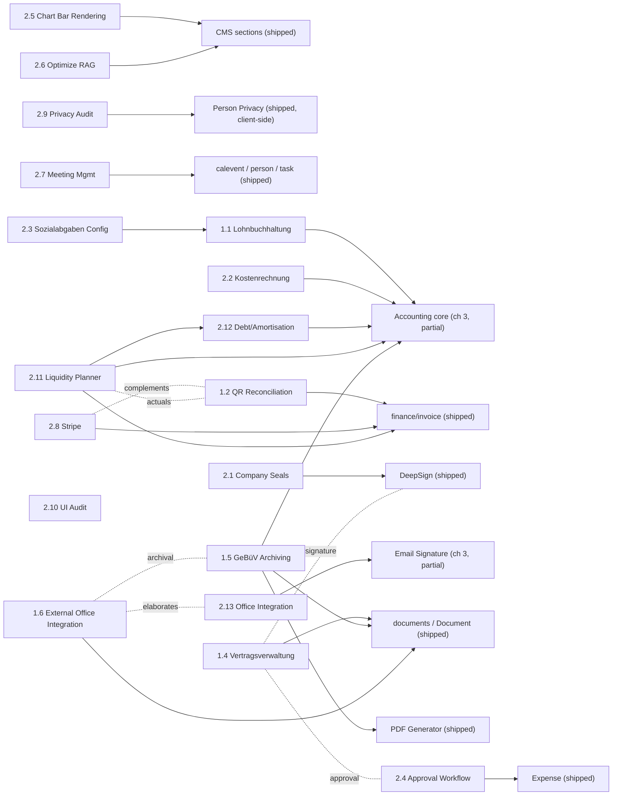

# Pending & Deferred Functionality

**Purpose:** A constantly-updated table of contents over every topic that has been **specified
but is not yet fully implemented**. Use it to see, at a glance, what is still open and where the
source doc lives. Each entry links back to its source and lists only the topics that were
**postponed or excluded** — never a description of what was built.

**Last compiled:** 2026-06-30.

## Document layout (`docs/`)

| Folder | Holds |
|--------|-------|
| `ideas/` | seed / stub specs not yet elaborated (chapter 2) |
| `specs/` | **all** spec & design docs, for their whole life — the *what & how* (chapters 1, 3, 4) |
| `plans/` | step-by-step implementation plans |
| `documentation/` | reference docs (not specs) — excluded from this TOC |
| `done/` | *(retired)* — reserved only for superseded/abandoned docs, if ever needed |

Specs and designs **stay in `specs/` permanently**; implementation status is tracked here via the
`State:` field, not by moving files. This TOC, grouped by State, is the single source of truth.

> **Status values:** `Open` (specified, not started) · `Partially implemented` (some scope shipped,
> work remaining) · `Fully implemented` (in-scope work done; only explicit non-goals / future work remain).
>
> Open-topic markers: 🔴 not started / explicitly out of scope · 🟡 partially done, work remaining ·
> ❓ open question / decision needed.

---

## 1. Specs awaiting implementation

Fully-written specs with **no (or only foundational) implementation** yet.

### 1.1 Lohnbuchhaltung (Swissdec payroll) — [`2026-05-28-spec-lohnbuchhaltung.md`](specs/2026-05-28-spec-lohnbuchhaltung.md)
**State:** Open. No `libs/finance/salary*` exists yet.
- 🔴 Whole feature open. Drives the deferred Sozialabgaben config (idea 2.3) and depends on the accounting core (Accounting, ch 3).

### 1.1a bk2 → okr / openkring Migration — [`2026-07-02-okr-migration-spec.md`](specs/2026-07-02-okr-migration-spec.md)
**State:** Open. Whole-repo rebrand (`bk2`/`@bk2`→`okr`/`@okr`, `bkey`→`okey`) + split into public `openkring/okr` core plus private per-app / planning / skills submodules.
- 🔴 Phases 0–7 all open (baseline → untrack transient dirs → deep rename → dir reorg → filter-repo split → purged public core + secret scan → wire submodules & publish → cutover verify).
- ❓ Video-producer path coupling, `bk-config.ts`→`okr-config.ts`, CI refs to `bkaiser-org/bk2` (§9 open questions).

### 1.2 QR Payment Reference & Bank Reconciliation — [`2026-06-17-qr-payment-reference-reconciliation-spec.md`](specs/2026-06-17-qr-payment-reference-reconciliation-spec.md)
**State:** Partially implemented (slip/Phase 0 work landing via the [QR Payment Slip design](specs/2026-06-17-qr-payment-slip-design.md); reconciliation phases open).
- 🟡 Phase 0 — `InvoiceModel.paymentReference`, `isQrIban` classifier, QRR generator, dual-IBAN slip logic.
- 🔴 Phase 1 — QRR live once a QR-IBAN is configured (validate on ZKB ISO-20022 platform).
- 🔴 Phase 2 — `reconcileCamt` callable (parse camt.054/053, auto-match on reference, mark paid).
- 🔴 Phase 3 — optional DeepPay fetch (DeepCloud REST) replacing the manual camt upload.
- 🟡 D3 — QR-IBAN procurement from ZKB.

### 1.3 PDF "Senden" — email the generated document — [`2026-06-17-pdf-send-email-design.md`](specs/2026-06-17-pdf-send-email-design.md)
**State:** Open (specified, not yet implemented). Adds a "Senden" action to `PdfPreviewModal` that emails the generated PDF via the existing `sendEmail` CF.
- 🔴 Bulk / multi-recipient member mailing — stays with `MessageCenterModal` (this is single-document, single-recipient).
- 🔴 Saving drafts; send history/audit log; scheduling.
- 🔴 Non-PDF output formats — button offered only when `outputFormat === 'pdf'`.

### 1.4 Tenant Provisioning (app-first) — [`2026-06-29-tenant-provisioning-design.md`](specs/2026-06-29-tenant-provisioning-design.md)
**State:** Partially implemented. The `@bk2/tools:app` generator + CMS-minimal template + the `provision-tenant` runbook skill are in place; per-tenant runs and the deferred topics below remain.
- 🟡 Component A/B — `tools/src/generators/app/files/` (CMS-minimal: bootstrap + auth + cms-page/section/menu + profile, all domain features stripped) + `@bk2/tools:app` Nx generator (token substitution, `--dry-run`, idempotent) — generator and template implemented and verified by end-to-end build.
- 🟡 Component C — the `provision-tenant` skill (`.claude/skills/provision-tenant/`) orchestrating Firebase MCP Web App registration, AppConfig doc, app scaffold, starter CMS pages/menu seed, `.env`, build verify, and first-admin-user creation. Runbook authored; exercised per tenant.
- 🔴 Per-use-case building blocks (okr/kring domain features grafted onto the shell) — planned future direction, separate spec.
- 🔴 Website (`TENANT-web`) scaffolding — deferred to a follow-up spec.
- 🔴 New Firebase project per tenant; tenant rules/functions/index deploys; per-tenant Sentry — out of scope (shared project reused).

### 1.5 Vertragsverwaltung (Contract Lifecycle Management) — [`2026-06-17-spec-vertragsverwaltung.md`](specs/2026-06-17-spec-vertragsverwaltung.md)
**State:** Open. No `libs/contract*` exists yet. Extends the `documents`/`Document` model; uses persons/orgs/memberships and the RAG/Gemini setup.
- 🔴 Whole feature open — `ContractModel` aggregate, lifecycle state machine, Fristen/Kündigung/Verlängerung reminders, contract hierarchy (§1).
- 🔴 Multi-stage approval workflow — v1 is status-tracking only (idea 2.4) (§1, §11.3).
- 🔴 Recurring bookings/receivables from contracts; clause library / contract generation (§1).
- 🔴 DeepSign coupling — `signatureType`/`signatories` stay manual in v1 (§11.7).
- ❓ Reminder channels (email/push), deliverables embedding vs subcollection, per-version workflow (§11).

### 1.6 GeBüV Archiving (documents + year-end package) — [`2026-06-17-spec-gebuev-archivierung.md`](specs/2026-06-17-spec-gebuev-archivierung.md)
**State:** Open. No `archiveDocument` / `buildFiscalYearArchive` CF or WORM bucket exists yet. Teil B depends on the accounting core (ch 3).
- 🔴 Teil A — tag-based per-document WORM archival (`onWrite` copy, SHA-256, Object Retention) (§2).
- 🔴 Teil B — per-fiscal-year package (signed PDF/A reports, ledgers, structured booking export + audit trail) (§B2).
- ❓ Teil A — `storagePath` source ref, multi-tenant copies, working-copy lifecycle cleanup (§11).
- ❓ Teil B — export format (JSON/CSV/XML), PDF/A generation, qualified signature, four-eyes before sealing (§B7).

### 1.7 External Office Integration (DocSpace / M365 / Workspace) — [`2026-06-17-spec-external-office-integration.md`](specs/2026-06-17-spec-external-office-integration.md)
**State:** Open. Elaborates idea 2.13 Office Integration; bk2 stays a pure API peer (never hosts an editor). Reuses the DeepSign webhook-HMAC pattern; snapshots may flow into GeBüV archival (1.5).
- 🔴 Whole feature open — `ExternalDocRef` + `DocumentSnapshot`, manual import, view-only sharing; phased Google → 2nd provider → cross-tenant → write-back (§10).
- 🔴 Non-goals — no embedded editor / Document Server / WOPI host; no real-time co-editing; Apple programmatic round-trip (§1, §11).
- ❓ Manual vs auto snapshot import; write-back scopes; automatic GeBüV WORM hook (§9).

### 1.8 Consistent Section Image Handling — [`2026-06-25-section-image-handling-design.md`](specs/2026-06-25-section-image-handling-design.md)
**State:** Open (specified, not started). Unifies image config across CMS sections (article/slider multi, hero two-named-single), one-time article `image`→`images[]` migration, upload from config modal + section list, single-image overwrite confirm, fixes the broken add-image button and mis-wired hero editor, nicer rich-text editor, and a global "show advanced" form toggle.
- 🔴 Whole feature open. `SectionImageService`, `showAdvanced` toggle, single-image upload, list ActionSheet upload action.
- 🔴 One-time `migrate-article-images` admin script must run before the read-time shim in `ArticleStore` is removed.
- 🔴 Out of scope — album directory model; tiering of non-image type-specific configs (map/chat/etc.); persisting the advanced toggle.

### 1.9 Person Duplicate Detection & Reconciliation — [`2026-06-29-person-duplicate-detection-design.md`](specs/2026-06-29-person-duplicate-detection-design.md)
**State:** Open (specified, not started). Replaces the name-only confirm in `PersonStore.add()` with a cross-tenant `findPersonDuplicates` callable (match on name/dateOfBirth/favEmail/ssnId), a candidate-list modal, a per-field reconcile modal, and a `mergePersonIntoTenant` callable that shares an existing person into the current tenant.
- 🔴 Whole feature open — two Cloud Functions, two feature modals, `computePersonFieldDiffs` util, new `add()` flow.
- 🔴 Out of scope — privacy filtering of candidate attributes (memberAdmin-gated, sees all); general merge tool for pre-existing duplicates.
- 🟡 Accepted simplifications — case-sensitive `lastName` match; fav-field address dedupe heuristic.

### 1.10 Mobile Release Pipeline (local builds + fastlane + Capawesome OTA) — [`2026-06-30-spec-mobile-release-pipeline.md`](specs/2026-06-30-spec-mobile-release-pipeline.md)
**State:** Open (specified, not started). Supersedes the parked cloud-build approach (`spec-capawesome-native-builds.md`). Local M4 native builds, fastlane store submission, and Capawesome Cloud Live Updates (OTA) for the web layer; only `@capawesome/capacitor-file-picker` is present today — no live-update plugin, channel config, or `Fastfile`.
- 🔴 Whole pipeline open — fastlane `Fastfile` (iOS/Android lanes), `@capawesome/capacitor-live-update` plugin + `capacitor.config.ts` channel/rollback config, `LiveUpdate.ready()`, versioned `production-N` channels (§7–§9), phased rollout (§14).
- 🔴 Signing custody — `match`/Keychain certs, Android keystore backup, ASC API key, Play service-account JSON (§6).
- 🔴 Hybrid CI — OTA bundle upload in GitHub Actions; native release stays local on the M4 (§11).
- 🔴 §5 binary-compatibility gate + §7 channel discipline to be documented in `CLAUDE.md` (Phase 5).
- ❓ OTA DPA + EU storage/CDN residency; bundle secret audit; `match` vs local certs; keystore origin; iOS extensions; versioned vs rolling channel; update UX; macOS-runner fallback (§15).
- 🔴 Out of scope — Capawesome Native Builds / cloud runners; Capawesome publishing; Electron/desktop (§1).

---

## 2. Ideas / backlog (`docs/ideas/`)

Seed specs to be elaborated later. Each links back to the spec it was deferred from (where applicable).

### 2.1 Company Seals — [`2026-06-17-company-seals-spec.md`](ideas/2026-06-17-company-seals-spec.md)
Org seal on signed PDFs. From DeepSign (ch 4, §1). Needs DeepSign (shipped).

### 2.2 Kostenrechnung — [`2026-06-17-kostenrechnung-spec.md`](ideas/2026-06-17-kostenrechnung-spec.md)
Cost-centre / cost-object accounting + report filter. From Accounting (ch 3, §3). Needs accounting core.

### 2.3 Sozialabgaben Configuration — [`2026-06-17-sozialabgaben-config-spec.md`](ideas/2026-06-17-sozialabgaben-config-spec.md)
Effective-dated contribution-rate config. From Accounting (ch 3, §3.8.7). Needs Lohnbuchhaltung (1.1).

### 2.4 Approval Workflow Module — [`2026-06-17-approval-workflow-module-spec.md`](ideas/2026-06-17-approval-workflow-module-spec.md)
Reusable four-eyes approval step. From Expense (ch 4, §1.2); also wanted by Application & Forms Builder.

### 2.5 Chart Bar Rendering — [`2026-06-17-chart-bar-rendering-spec.md`](ideas/2026-06-17-chart-bar-rendering-spec.md)
Bar-chart view for `member-age`/`member-cat`. From CMS Improvements (ch 3, §16). Needs echarts in those renderers.

### 2.6 Optimize RAG — [`2026-06-17-optimize-rag-spec.md`](ideas/2026-06-17-optimize-rag-spec.md)
Apply saved RAG config + improve quality. From CMS Improvements (ch 3, §15). Needs `queryRag` CF changes.

### 2.7 Meeting Management — [`2026-06-17-meeting-management-spec.md`](ideas/2026-06-17-meeting-management-spec.md)
Agenda, attendees, minutes → action-item tasks. New. Builds on `calevent`/`person`/`task`.

### 2.8 Stripe Integration — [`2026-06-17-stripe-integration-spec.md`](ideas/2026-06-17-stripe-integration-spec.md)
Card/online payments + webhook reconciliation. New. Complements QR reconciliation (1.2).

### 2.9 Privacy Audit — [`2026-06-17-privacy-audit-spec.md`](ideas/2026-06-17-privacy-audit-spec.md)
Real server-side person-data enforcement + DSG checklist. New. Builds on Person Privacy (ch 4).

### 2.10 UI Audit — [`2026-06-17-ui-audit-spec.md`](ideas/2026-06-17-ui-audit-spec.md)
Consistency / a11y / responsive / theming review. New. Cross-cutting.

### 2.11 Liquidity Planner — [`2026-06-17-liquidity-planner-spec.md`](ideas/2026-06-17-liquidity-planner-spec.md)
Cash-position forecast. New. Needs accounting core, invoices, Debt Planner (2.12), reconciliation actuals.

### 2.12 Debt / Amortisation Planner — [`2026-06-17-debt-amortisation-planner-spec.md`](ideas/2026-06-17-debt-amortisation-planner-spec.md)
Loan amortisation schedules. New. Needs accounting core; feeds Liquidity Planner (2.11).

### 2.13 Office Integration — [`2026-06-17-office-integration-spec.md`](ideas/2026-06-17-office-integration-spec.md)
Google Workspace / Microsoft 365 mail/calendar/docs. New (scope TBC). Extends Email Signature (ch 3, §9).

### Dependency graph

Edge `A --> B` reads **"A depends on B"** (B is the prerequisite). Dashed = complementary, not blocking.

---

## 3. Partially implemented

Specs/designs with some scope shipped and concrete work remaining.

### 3.1 SCS Website Integration — [`2026-05-11-scs-website-integration-design.md`](specs/2026-05-11-scs-website-integration-design.md)
- 🔴 Courses & competition-results models/endpoints; App Check rate-limiting; full `I18nString` migration of section/CalEvent text; website preview/live-edit; SEO sitemap; asset image CDN (§8).

### 3.2 CMS Improvements — [`2026-05-26-cms-improvements-spec.md`](specs/2026-05-26-cms-improvements-spec.md) · review [`2026-05-25-cms-review.md`](specs/2026-05-25-cms-review.md)
- 🔴 §16 `chartType='bar'` rendering — see idea 2.5.
- 🔴 §15 RAG optimisation (apply saved config, quality) — see idea 2.6.
- 🟡 §14 reindex backfill — one-shot `reindex-cms.ts` to recompute existing indices not written.
- 🟡 §17 blog-layout visual smoke test — needs the running app.

### 3.3 Accounting / Buchhaltung — [`2026-05-27-buchhaltungssystem-spezifikation.md`](specs/2026-05-27-buchhaltungssystem-spezifikation.md)
`libs/finance/booking`, `libs/finance/journal` exist; advanced phases open.
- 🔴 Lohnbuchhaltung (1.1); Kostenrechnung (idea 2.2); Sozialabgaben config (idea 2.3).
- 🔴 EBICS direct connection; Bexio Payments API upload (`bexio_api`) — later stages.
- 🔴 Supplier-invoice platforms (eBill, Peppol BIS Billing 3.0); Lagerbuchhaltung; multi-mandant consolidation (§1, §7).
- 🟡 `journallogs`→`bookings` migration + `BookingJournalModel`→`BookingModel` rename — **not done**; old `booking-journal.model.ts` is still used by `finance/journal` alongside the new `booking.model.ts`.

### 3.4 Accounting System (design) — [`2026-05-27-accounting-system-design.md`](specs/2026-05-27-accounting-system-design.md)
Mirrors 3.3.
- 🔴 Lohnbuchhaltung/Sozialabgaben; Kostenrechnung; EBICS; eBill/Peppol; Spesenabrechnung; konsolidierte Bilanz (Folgeprojekte).

### 3.5 Forms Builder — [`2026-05-27-forms-builder-spec.md`](specs/2026-05-27-forms-builder-spec.md)
v1 scope shipped; phased remainder open.
- 🔴 Multi-page/multi-step forms; generic 3rd-party integrations; inbound email parsing; `visibleIf` editor; A/B testing; server-side e-signature (§1, §16).
- 🟡 Later phases P2–P6 — URL target/submission CF/audit/CSV (P2), spam protection (P3), CAPTCHA + encrypted upload (P4), approval (idea 2.4) + email (P5), PDF export/template fill (P6) (§18).
- 🟡 Encrypted file-upload PBKDF2 parameters — confirm with security review (§9.2).

### 3.6 Sentry Integration — [`2026-06-06-spec-sentry-integration.md`](specs/2026-06-06-spec-sentry-integration.md)
Phase 1 in progress (`init-sentry.ts`); see plan [`2026-06-17-sentry-integration.md`](plans/2026-06-17-sentry-integration.md); setup guide in [`documentation/2026-06-17-sentry-setup-design.md`](documentation/2026-06-17-sentry-setup-design.md).
- 🔴 Phase 2 — CI source-map upload + releases / release health.
- 🔴 Phase 3 — native symbolication (Gradle/dSYM).
- 🔴 Phase 4 — Cloud Functions backend (`@sentry/node`); Session Replay stays off (§11, §12).

### 3.7 Security Review — [`2026-06-11-security-report.md`](specs/2026-06-11-security-report.md)
All Critical/High fixes deployed; the items below are genuine remaining work, not deploy steps.
- 🔴 C-3 verify the 6 `oidc*` functions are actually deleted + remove stale OIDC provider config from Synapse.
- 🔴 H-1/M-9 Storage content-type allowlist (Phase 2; confirm MIME set against real SDK uploads).
- 🔴 M-7(a) per-collection write RBAC for collections beyond CMS (needs write-call-site analysis).
- 🔴 M-10 move `matrix-js-sdk` from pre-release to a stable release.
- 🔴 M-11 wire the emulator Firestore-rules tests (27-case harness) into CI.
- 🔴 L-1 CSP `unsafe-inline`/`unsafe-eval` removal — blocked by `/web` (Tailwind Play CDN + inline scripts).
- 🟡 C-4 optional git-history rewrite; C-5/H-6 `matrixPushGateway` shared-secret review; info items I-1…I-5.

### 3.8 PWA Caching — [`2026-06-12-spec-pwa-caching.md`](specs/2026-06-12-spec-pwa-caching.md)
- 🔴 `test-app` and static websites; Imgix `dataGroup` caching; dedicated bundle-size spec (§scope, §images, §10).
- 🟡 Multi-tab IndexedDB manager; `IndexedDBCryptoStore` for Matrix E2EE; force-reload-on-build; bundle-size investigations (§7, §Matrix).

### 3.9 vCard Export — [`2026-06-12-spec-vcard-export.md`](specs/2026-06-12-spec-vcard-export.md)
Tiers 1 & 2 ship.
- 🟡 Tier 3 (memberAdmin multi-select) — callable enforces cap, no UI wired (§5, §6.2).
- 🟡 `orgLinks` (parent/child orgs) omitted; registered read-model projection (§7) not added.
- 🔴 vCard 4.0 profile; per-platform export profiles — explicit non-goals (§2.1).

### 3.10 Matrix Chat Audit — [`2026-06-12-matrix-chat-audit.md`](specs/2026-06-12-matrix-chat-audit.md)
Symptom fixes, SEC/ARCH/C-*/P-* hygiene deployed.
- 🟡 S1/S2 duplicate-identity data migration; ARCH-4 client-side identity dedup; ARCH-5 `ensureAdminInRoom` helper; P-5 user-scoped store.
- 🔴 ARCH-2 split 1837-line `MatrixChatService`; C-5 scroll-back pagination; P-3/P-4/P-6 perf; SEC-5 notification/enumeration vectors; S5 group-bkey masking; E2EE by default (§9).
- ❓ SEC-6 role source-of-truth (rules vs `requireRole`).

### 3.11 Email Signature — [`2026-06-16-spec-email-signature.md`](specs/2026-06-16-spec-email-signature.md)
`signature.service.ts`, `email-signature.accordion.ts`, signature util/model landing.
- 🔴 Org-managed/enforced signatures; dark-mode logo variant; multiple signatures per org (§9).
- 🔴 Direct Gmail API / Outlook Graph install — see idea 2.13 Office Integration (§9).

---

## 4. Fully implemented

In-scope work complete; only explicit non-goals / future work remain.

### 4.1 Poll Create — [`2026-04-29-poll-create-design.md`](specs/2026-04-29-poll-create-design.md)
🔴 result display in message list; poll end; multiple-choice (`max_selections>1`); thread-aware sending.

### 4.2 Poll Display — [`2026-04-29-poll-display-design.md`](specs/2026-04-29-poll-display-design.md)
🔴 multiple-choice; per-voter identity; thread-aware voting.

### 4.3 Flighttracker — [`2026-05-04-flighttracker-design.md`](specs/2026-05-04-flighttracker-design.md)
🔴 polling/auto-refresh; lookup history; search by route; SSR map rendering.

### 4.4 Flighttracker — Icon rotation — [`2026-05-04-flighttracker-icon-rotation-design.md`](specs/2026-05-04-flighttracker-icon-rotation-design.md)
🔴 snapping to discrete headings; animating rotation on reload.

### 4.5 Flighttracker — Route line — [`2026-05-04-flighttracker-route-line-design.md`](specs/2026-05-04-flighttracker-route-line-design.md)
🔴 animated plane movement; actual filed path (great-circle only); dashed line.

### 4.6 News Thumbnail — [`2026-05-05-news-thumbnail-design.md`](specs/2026-05-05-news-thumbnail-design.md)
Single-file change, no deferred topics.

### 4.7 Notification Badges — [`2026-05-05-notification-badges-design.md`](specs/2026-05-05-notification-badges-design.md)
🔴 messages-section badge not wired (per-room unread shown instead); no model/AppStore change.

### 4.8 Session Analytics — [`2026-05-05-session-analytics-design.md`](specs/2026-05-05-session-analytics-design.md)
🔴 retention/auto-cleanup; aggregated stats charts; BigQuery/Sheets export.

### 4.9 Members Accordion — membertype filter — [`2026-05-06-members-accordion-membertype-filter-design.md`](specs/2026-05-06-members-accordion-membertype-filter-design.md)
🔴 store-level filter state; `'all'` option.

### 4.10 Schedule Poll — [`2026-05-06-schedule-poll-design.md`](specs/2026-05-06-schedule-poll-design.md)
🔴 public/open-event scheduling; external participants; recurring schedules; persisted draft.

### 4.11 Chat Image Thumbnails — [`2026-05-07-chat-image-thumbnails-design.md`](specs/2026-05-07-chat-image-thumbnails-design.md)
No deferred topics noted.

### 4.12 Matrix Read Receipts — [`2026-05-08-matrix-read-receipts-design.md`](specs/2026-05-08-matrix-read-receipts-design.md)
No deferred topics noted.

### 4.13 Quick-Entry Triggers — [`2026-05-10-quick-entry-triggers-design.md`](specs/2026-05-10-quick-entry-triggers-design.md)
🔴 `!!` location trigger (separate spec); task quick entry (separate feature).

### 4.14 i18n per-module — [`2026-05-12-i18n-per-module-design.md`](specs/2026-05-12-i18n-per-module-design.md)
🟡 `test-app` scoped translations; auto-generate asset globs; CI check for declared-but-empty scopes.

### 4.15 Alert Service — [`2026-05-15-alert-service-design.md`](specs/2026-05-15-alert-service-design.md)
No deferred topics noted.

### 4.16 Member-Age Section — [`2026-05-21-member-age-section-design.md`](specs/2026-05-21-member-age-section-design.md)
🟡 bar-chart rendering still open (idea 2.5); unknown-gender members excluded silently; export/print formatting.

### 4.17 CMS Section i18n pattern — [`2026-05-22-cms-section-i18n-pattern-design.md`](specs/2026-05-22-cms-section-i18n-pattern-design.md)
No deferred topics noted.

### 4.18 PDF Generator — [`2026-05-25-pdf-generator-spezifikation.md`](specs/2026-05-25-pdf-generator-spezifikation.md)
🔴 WYSIWYG template editing (source/preview editor only); client-side document generation; integrated email dispatch in the CF — stays client-side over Mailgun (§1.3, §8.4).

### 4.19 DeepSign E-Signature — [`2026-05-25-deepsign-integration-spec.md`](specs/2026-05-25-deepsign-integration-spec.md)
v1.
🔴 Company seals (idea 2.1); hash signing; ad-hoc signee/observer API; manual field placement; batch upload & attachments (§1); non-PDF MIME types — only `application/pdf` (§9).

### 4.20 Expense Feature — [`2026-05-25-expense-feature-spezifikation.md`](specs/2026-05-25-expense-feature-spezifikation.md)
`libs/finance/expense`.
🔴 Approval-workflow module (idea 2.4); travel-expense flat rates; credit-card integration (§1.2).
❓ Auto-payout (pain.001); foreign-VAT default; multi-currency per expense; OCR learning loop; duplicate-receipt behaviour (§9).

### 4.21 Trip Feature — [`2026-05-25-trip-feature-spec.md`](specs/2026-05-25-trip-feature-spec.md)
🔴 Multi-stop trip recording; automated GPS-track distance; guest management (§1.2).
❓ `kiosk` role; `flagged` field; `trip_responsibility` notification mechanism; `dev_responsibility` source; `aoc/trip` access (§17).

### 4.22 Trip Statistics (Firestore) — [`2026-05-25-trip-stats-firestore-spec.md`](specs/2026-05-25-trip-stats-firestore-spec.md)
❓ Exact `COUNTING_STATES`; kiosk in-place edit of `open` trips; full state-transition audit log (§8).

### 4.23 Trip Feature (design) — [`2026-05-26-trip-feature-design.md`](specs/2026-05-26-trip-feature-design.md)
Open topics tracked under 4.21; map library resolved (Capacitor Google Maps).

### 4.24 Trip Stats (design) — [`2026-05-26-trip-stats-design.md`](specs/2026-05-26-trip-stats-design.md)
Open questions tracked under 4.22; design decisions all resolved.

### 4.25 Application Feature — [`2026-05-27-application-feature-spec.md`](specs/2026-05-27-application-feature-spec.md)
Iteration scope.
🔴 Public submission page (→ Forms Builder); anonymous CAPTCHA/rate-limiting; document upload; payment at application; cross-club transfer flows; automatic account creation (§1.2).
🟡 Per-membership-category responsibility routing — generic for now.

### 4.26 Expense Feature (design) — [`2026-05-28-expense-feature-design.md`](specs/2026-05-28-expense-feature-design.md)
See 4.20.
🔴 OCR extraction; approval workflow (idea 2.4); OCR VAT lines; multi-currency; auto pain.001; offline draft caching; duplicate-receipt detection; amount-diff dialog; expense-account admin config.

### 4.27 Cookie Consent — [`2026-05-25-cookie-consent-specification.md`](specs/2026-05-25-cookie-consent-specification.md) · impl [`2026-05-29-cookie-consent-implementation.md`](specs/2026-05-29-cookie-consent-implementation.md)
🔴 Granular preferences modal (§7.5); server-side consent sync to Firestore (audit); Google Consent Mode v2; geo-aware banner; re-prompt interval (§12).

### 4.28 Validation i18n refactor — [`2026-05-30-validation-i18n-refactor-design.md`](specs/2026-05-30-validation-i18n-refactor-design.md)
🔴 adding `de.json` to libs already working via `@key`; translating to en/fr/es/it; changing `I18nService.translate()`.

### 4.29 Move Icon into CMS — [`2026-06-05-move-icon-into-cms-design.md`](specs/2026-06-05-move-icon-into-cms-design.md)
No deferred topics noted.

### 4.30 LocationSelect — Free-text route — [`2026-06-11-spec-location-select-custom.md`](specs/2026-06-11-spec-location-select-custom.md)
🔴 Recently-used / promoted free-text routes (caching or promotion to `locations`) (§9).

### 4.31 LocationSelect — Map view — [`2026-06-12-spec-location-select-map.md`](specs/2026-06-12-spec-location-select-map.md)
🟡 Marker clustering (`leaflet.markercluster`) — deferred until a tenant exceeds the threshold.

### 4.32 Vest → Signal Forms Migration — [`2026-06-12-vest-to-signal-forms-migration-spec.md`](specs/2026-06-12-vest-to-signal-forms-migration-spec.md)
All five phases done.
🟡 Cleanup nit — ~29 edit-modals carry a stale `scVestForm` comment; update when next touched.

### 4.33 Person Privacy on PersonModel — [`2026-06-14-person-privacy-on-personmodel-design.md`](specs/2026-06-14-person-privacy-on-personmodel-design.md)
Client-side.
🔴 real server-side enforcement (`getPersonView` CF, locked reads, `iban` flag) — see idea 2.9 Privacy Audit.

### 4.34 Booking Counterparty Actions — [`2026-06-16-booking-counterparty-actions-design.md`](specs/2026-06-16-booking-counterparty-actions-design.md)
`generateDocument` action.
🔴 runtime/admin CRUD for the action registry; multi-currency receipts; `createTask` action (marked future).

### 4.35 Page Print — [`2026-06-17-page-print-design.md`](specs/2026-06-17-page-print-design.md)
🔴 faithful rendering of interactive sections (`chat`/`rag`/`form`/`tracker`) — skipped with placeholder; maps/iframes best-effort (may render blank).

### 4.36 QR Payment Slip — [`2026-06-17-qr-payment-slip-design.md`](specs/2026-06-17-qr-payment-slip-design.md)
Unstructured slip.
🔴 structured QR references (QRR/SCOR) + QR-IBAN → see awaiting-impl spec 1.2; per-generation QR-setting override; non-CHF currencies.

### 4.37 AOC Session Extension — [`2026-06-24-aoc-session-extension-design.md`](specs/2026-06-24-aoc-session-extension-design.md)
`aoc-session` list view reworked (bk-list-filter search/status, context menu, per-row ActionSheet, session-detail/statistics modals, `SessionModel.index`, `libs/session/{data-access,util}`).
🔴 Persisting hidden-user list / chosen duration across reloads; reusable `session` UI lib; pagination/virtual scroll; editing/deleting sessions (read-only admin view) (§8).
❓ `getSessionIndex` placement; `exportRaw` CSV columns; orphan/stale thresholds (10/30 min) (§9).
