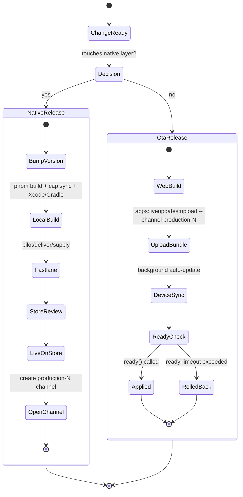

# spec-mobile-release-pipeline

**Status:** Draft · **Owner:** Bruno · **Last updated:** 2026-06-30
**Supersedes:** `spec-capawesome-native-builds.md` (cloud-build approach, parked)
**Scope:** Mobile release pipeline for the bk2 Capacitor app — **local builds (M4) + fastlane publishing + Capawesome Cloud Live Updates (OTA)**
**Related:** `spec-pwa-caching.md`, `spec-sentry-integration.md`
**Context:** Replacement path for Ionic Appflow (commercial products EOL 2027-12-31)

---

## 1. Zweck & Geltungsbereich (Purpose & Scope)

Define how bk2 produces, publishes, and updates native iOS and Android apps using **local builds on the developer M4 Mac**, **fastlane** for store submission automation, and **Capawesome Cloud Live Updates** for over-the-air web-layer updates. Cloud native builds are deliberately *not* used — the M4 already builds both platforms locally, which is cheaper, keeps source off third-party runners, and removes a vendor from the build path.

### In scope
- Local build of `.ipa` (iOS) and `.aab`/`.apk` (Android) on the M4
- fastlane lanes for TestFlight, App Store, and Google Play submission
- Local signing custody (Apple certificate/profile, Android keystore)
- Capawesome Live Updates: plugin config, channels, bundle upload, rollback safety
- Binary-compatibility governance (what may ship OTA vs. what needs a store release)
- Hybrid CI: GitHub Actions for tests + OTA bundle upload; native release stays local
- Swiss regulatory considerations (DSG/revFADP, OTA data residency, key custody)

### Out of scope
- Capawesome Native Builds / cloud build runners (parked — see superseded spec)
- Capawesome App Store Publishing (publishing is handled by fastlane in this design; Capawesome publishing appears coupled to its own cloud builds and is not used here)
- Electron / desktop targets (dropped)

---

## 2. Ausgangslage & Entscheid (Context & decision)

bk2 stack: Angular (standalone + signals), Ionic v8, **Capacitor**, **pnpm**, Firebase. A Capacitor app is two layers: a **web layer** (Angular bundle in a WebView) and a **native layer** (the iOS/Android shells + plugins). OTA updates the web layer only; the native layer changes only via a store release.

Decision rationale for Option A:
- The M4 builds **both** platforms locally — iOS via Xcode, Android via Gradle/JDK (Android tooling runs natively on Apple Silicon). No Mac-rental or cloud-build need.
- **Cost:** local builds consume no build minutes; fastlane is free/open-source; only OTA uses a paid Capawesome tier (free tier available).
- **Data residency:** source never leaves the machine for builds — nothing to enter in the DSG processing register for the build step. Only OTA bundles touch a third-party service (EU-hosted — see §13).
- The high-value Capawesome feature for an evolving SaaS is OTA: shipping a JS/CSS fix in seconds instead of waiting on store review.

Trade-off accepted: the developer's M4 **is** the build/release server for native releases. Fully unattended "tag → store release" without that machine would need a hosted macOS runner; that is explicitly not a goal here. OTA, by contrast, *is* automatable in cheap Linux CI (§12).

---

## 3. Architektur-Überblick (Pipeline)

```
                         bk2 repo (pnpm workspace)
                                  │
              ┌───────────────────┼────────────────────┐
              ▼                   ▼                     ▼
   NATIVE RELEASE (local M4)              OTA RELEASE (web layer only)
   pnpm build → cap sync                  pnpm build (web assets)
   → Xcode build (.ipa)                          │
   → Gradle bundle (.aab)                         ▼
        │                                  @capawesome/cli
        ▼                                  apps:liveupdates:upload
   fastlane                                  → Capawesome Cloud (EU CDN)
   pilot/deliver  → App Store / TestFlight         │
   supply         → Google Play                    ▼
        │                                  device LiveUpdate.sync()
        ▼                                  (RSA-verified, auto-applied)
   Store review → users get NEW NATIVE      users get NEW WEB BUNDLE
                  binary                     (no store review)
```

The native release and the OTA release are two distinct cadences. §5 governs which changes belong to which.

---

## 4. Build-Umgebung auf dem M4 (Local build environment)

One-time toolchain on the M4:

| Tool | Purpose |
|---|---|
| Xcode (+ Command Line Tools) | iOS build & signing |
| JDK 17+ and Android SDK / Gradle | Android build (runs natively on Apple Silicon) |
| Node + **pnpm** | web build |
| CocoaPods **or** Swift Package Manager | iOS native dependencies (SPM preferred for new Capacitor) |
| Ruby + **fastlane** (`brew install fastlane`) | store submission lanes |

Standard build sequence (driven by fastlane in §8, shown here explicitly):

```bash
pnpm install
pnpm run build            # Angular production build → dist/
npx cap sync              # copy web assets + sync native projects/plugins
# then per-platform native build (handled by fastlane lanes)
```

> Pin the Node major to the one used in the GitHub Actions test pipeline to avoid "tests pass / build differs" drift.

---

## 5. Binär-Kompatibilität — die zentrale Regel (Binary compatibility — the governing rule)

**This is the most important operational constraint in the whole pipeline.**

Live updates may carry **binary-compatible changes only** — HTML, CSS, JavaScript (the web layer). Any change to the native layer — adding/updating a Capacitor plugin, native config, Capacitor major bumps, native code — **requires a new store release**, not an OTA.

Consequences encoded in this spec:
- Every OTA bundle must be restricted to the **native version it was built against**, so an incompatible bundle can never land on an older/newer binary. Capawesome enforces this via **versioned channels** and version-code restrictions (§9, §11).
- On a native release, the native version code is incremented; Capacitor automatically resets to the built-in bundle, and a **new channel** for that version code begins receiving OTA bundles.

Decision gate for any change: *does it touch the native layer?* → **yes** = store release (fastlane); **no** = OTA bundle.

---

## 6. Signing (locally held)

Signing identities live on the M4 (and a secure backup), not in a cloud build vault.

### 6.1 iOS
- Apple **distribution certificate** + **provisioning profile** in the local Keychain.
- **App Store Connect API key** (`.p8` + key id + issuer id) for fastlane upload auth — preferred over Apple-ID/2FA.
- **Recommended:** `fastlane match` to store certs/profiles in a private, encrypted Git repo. This gives reproducibility and a recovery path if the Mac is lost, and is how a second machine (or future teammate) would bootstrap signing.

### 6.2 Android
- **Release keystore** (JKS/PKCS#12) held on the M4 **and** mirrored to bk2's secret store (e.g. sealed GCP Secret Manager), with a named recovery owner.
- **Google Play service account JSON** for `supply` upload auth.
- ⚠️ Losing the release keystore = permanent loss of the ability to update the published Android app. This is the single most critical secret; treat its backup as a release-blocker if missing.

---

## 7. Versionierung & Kanal-Strategie (Versioning & channel strategy)

Keep the native version code and the OTA channel in lockstep using **versioned channels** (recommended by Capawesome over runtime channel logic):

- Native version code `N` ⇒ channel `production-N`.
- Configure the channel **natively at build time** (no TypeScript boilerplate), requires plugin ≥ 8.2.0:
  - Android (`build.gradle`): `resValue "string", "capawesome_live_update_default_channel", "production-" + defaultConfig.versionCode`
  - iOS (`Info.plist`): `CapawesomeLiveUpdateDefaultChannel`
- Create the channel before publishing to it:
  ```bash
  npx @capawesome/cli apps:channels:create --name production-10
  ```
- A device on native version 10 only ever pulls `production-10` bundles → incompatible bundles are structurally impossible.

This makes the native release the moment a new channel "opens"; all subsequent OTA fixes target that channel until the next native release.

---

## 8. fastlane — Store-Publishing

Idiomatic multi-platform layout: root `fastlane/Fastfile` with `:ios` and `:android` platforms. Web build + `cap sync` run before the native build step.

```ruby
# fastlane/Fastfile  (indicative — verify options against installed fastlane)
before_all do
  sh "pnpm", "install"
  sh "pnpm", "run", "build"
  sh "npx", "cap", "sync"
end

platform :ios do
  desc "Build and upload to TestFlight"
  lane :beta do
    build_app(
      workspace: "ios/App/App.xcworkspace",
      scheme: "App",
      export_method: "app-store"
    )
    upload_to_testflight(
      api_key_path: "fastlane/asc_api_key.json"
    )
  end

  desc "Promote current build to App Store review"
  lane :release do
    deliver(
      api_key_path: "fastlane/asc_api_key.json",
      submit_for_review: true,
      precheck_include_in_app_purchases: false
    )
  end
end

platform :android do
  desc "Build AAB and upload to Play internal track"
  lane :internal do
    gradle(project_dir: "android", task: "bundle", build_type: "Release")
    upload_to_play_store(
      track: "internal",
      aab: "android/app/build/outputs/bundle/release/app-release.aab",
      json_key: "fastlane/play_service_account.json"
    )
  end

  desc "Promote to Play production"
  lane :release do
    upload_to_play_store(
      track: "production",
      aab: "android/app/build/outputs/bundle/release/app-release.aab",
      json_key: "fastlane/play_service_account.json"
    )
  end
end
```

Usage: `fastlane ios beta`, `fastlane android internal`, etc. iOS App Store builds appear in TestFlight automatically after Apple processing; Play internal track is shareable without review.

> Keep `asc_api_key.json`, `play_service_account.json`, and any match passphrase **out of the repo** (gitignored, sourced from the local secret store / env).

---

## 9. Capawesome Live Updates (OTA)

OTA-only usage: create a Capawesome app for the App ID; **no Git connection and no native-build setup are required** in this mode.

### 9.1 Plugin install
```bash
pnpm add @capawesome/capacitor-live-update
npx cap sync
```

### 9.2 Capacitor config
```typescript
/// <reference types="@capawesome/capacitor-live-update" />
import { CapacitorConfig } from '@capacitor/cli';

const config: CapacitorConfig = {
  plugins: {
    LiveUpdate: {
      appId: '<CAPAWESOME_APP_ID>',        // UUID from Capawesome Console
      autoUpdateStrategy: 'background',     // check on start/resume, apply next launch
      autoBlockRolledBackBundles: true,     // skip a bundle that previously rolled back
      readyTimeout: 10000,                  // ms to wait for ready() before rollback
      publicKey: '<RSA_PUBLIC_KEY>',        // verifies bundle signature on device
      serverDomain: 'api.cloud.capawesome.eu', // EU endpoint (see §13)
      // defaultChannel omitted — channel is set natively per version code (§7)
    },
  },
};
export default config;
```

```typescript
// Reference shape of the relevant options (documentation aid)
type AutoUpdateStrategy = 'background';
interface LiveUpdatePluginConfig {
  appId: string;
  autoUpdateStrategy?: AutoUpdateStrategy;
  autoBlockRolledBackBundles?: boolean;
  readyTimeout?: number;
  publicKey?: string;        // bundle integrity/authenticity check
  serverDomain?: string;     // 'api.cloud.capawesome.eu' for EU residency
  defaultChannel?: string;   // prefer native per-version channel config instead
}
```

### 9.3 Rollback safety (mandatory)
Call `ready()` early in app startup so a broken bundle auto-rolls back instead of bricking the app:
```typescript
import { LiveUpdate } from '@capawesome/capacitor-live-update';
// as early as possible after the app is interactive:
await LiveUpdate.ready();
```
With `autoUpdateStrategy: 'background'` no manual `sync()` is needed; the plugin checks, downloads, and applies on next launch. Enable rollouts (10/25/50/100%) for staged exposure.

### 9.4 Publishing a bundle
```bash
pnpm run build
npx @capawesome/cli apps:liveupdates:upload \
  --app-id <CAPAWESOME_APP_ID> \
  --path dist \
  --channel production-<versionCode> \
  --yes
```
The CLI zips the web build and uploads it; it becomes available to matching devices immediately. Optimise bundle size (drop source maps from the OTA artifact) for faster downloads and lower transfer.

---

## 10. Release-Lebenszyklus (Release lifecycle)



---

## 11. CI/CD-Integration für bk2 (Hybrid)

| Stage | Where | Notes |
|---|---|---|
| Lint, type-check, unit tests (every PR) | **GitHub Actions** (Linux) | cheap, runs beside the repo |
| **OTA bundle upload** | **GitHub Actions** (Linux) | web build + `apps:liveupdates:upload`; **no Mac needed** — needs `CAPAWESOME_CLOUD_TOKEN` secret. Can run on push to a release branch or on tag |
| Native build + store submit | **Local M4 + fastlane** | manual/local; the only step that needs the Mac and signing identities |

Key insight: OTA is the frequent, automatable path and runs in cheap Linux CI; native releases are infrequent and stay local. This gives most of the automation benefit without a hosted macOS runner.

A typical OTA GitHub Actions step:
```yaml
- run: pnpm install && pnpm run build
- run: npx @capawesome/cli apps:liveupdates:upload
       --app-id ${{ secrets.CAPAWESOME_APP_ID }}
       --path dist --channel production-${{ env.VERSION_CODE }} --yes
  env:
    CAPAWESOME_CLOUD_TOKEN: ${{ secrets.CAPAWESOME_CLOUD_TOKEN }}
```

---

## 12. Sicherheit & Schweizer Compliance (Security & Swiss compliance)

**Strengths of this design:**
- Build source code **never leaves the M4** — no third-party build runner processes proprietary code. Removes the build step from the DSG processing register entirely.
- OTA bundles are **RSA-signed and verified on-device** via the configured `publicKey` before they run — integrity + authenticity guaranteed.
- The plugin's default endpoint is the **EU region** (`api.cloud.capawesome.eu`), aligning with bk2's existing EU-data-residency choices (cf. Sentry).

**To confirm / control:**
- **OTA processor relationship:** Capawesome Cloud processes update bundles + device check-in metadata. Sign a **DPA / Auftragsverarbeitungsvertrag**; confirm the EU endpoint covers bundle storage *and* CDN edge for your users, and what device metadata (IDs, IPs) is logged.
- **Bundle contents:** an OTA bundle is the compiled web build — ensure no secrets/API keys/PII are baked into web assets at build time (they would then sit on the CDN). Audit `dist/` before first upload.
- **Keystore + signing custody:** held locally with an off-machine encrypted backup and a named recovery owner (§6).
- **Token scope:** the `CAPAWESOME_CLOUD_TOKEN` used in CI should be scoped to bundle upload only.

---

## 13. Kostenmodell (Cost model)

| Item | Cost |
|---|---|
| Local builds (M4) | none (hardware already owned) |
| fastlane | free / open-source |
| Capawesome Live Updates | free tier available; paid OTA tiers scale by usage (MAU / bandwidth) — confirm current tier pricing before committing |
| Apple Developer Program | ~$99/year |
| Google Play Console | ~$25 one-time |

Net: materially cheaper than any cloud-build option, with the OTA tier the only recurring SaaS line. Confirm live OTA pricing on the Capawesome pricing page (numbers move).

---

## 14. Rollout-Plan (Phased)

1. **Phase 0 — Local build proof:** on the M4, `pnpm build → cap sync → npx cap run ios/android`; confirm both platforms build and run.
2. **Phase 1 — Signing + manual submit:** set up iOS cert/profile (+ optional `match`), Android keystore, App Store Connect API key, Play service account; do one manual TestFlight + Play internal upload.
3. **Phase 2 — fastlane lanes:** add the `Fastfile`; reproduce Phase 1 via `fastlane ios beta` / `fastlane android internal`.
4. **Phase 3 — OTA wiring:** create Capawesome app, install plugin, configure `capacitor.config.ts` + native versioned channel, add `LiveUpdate.ready()`, ship a test bundle to a staging channel, verify auto-update + rollback.
5. **Phase 4 — OTA in CI:** move bundle upload into GitHub Actions on the release branch/tag; keep native releases local.
6. **Phase 5 — governance:** document the §5 binary-compatibility gate and §7 channel/version discipline in `CLAUDE.md` so future Claude Code sessions follow it.

---

## 15. Offene Fragen (Open Questions)

1. **OTA DPA + residency confirmation:** EU endpoint covers storage *and* CDN edge for CH users? What device metadata is retained, and for how long?
2. **Bundle audit:** any secrets/config currently inlined into the Angular production build that must not ship to the CDN?
3. **Signing bootstrap:** adopt `fastlane match` (private encrypted Git repo) now, or manage local Keychain certs directly? (match recommended for recovery.)
4. **Keystore origin:** reuse an existing release keystore or generate fresh now (and record custody)?
5. **App extensions:** does bk2 ship any iOS extensions (each needs its own provisioning profile)?
6. **Channel granularity:** versioned channels per version code (recommended) vs. a single rolling `production` channel — confirm the versioned approach.
7. **Update UX:** silent background apply (default) vs. prompt-to-reload via the `nextBundleSet` listener for user-visible updates?
8. **Native-runner fallback:** is fully unattended native release ever needed (would require a hosted/self-hosted macOS runner), or is local-on-M4 acceptable indefinitely?

---

## 16. Anhang (Appendix)

### Command reference
```bash
# Build (local)
pnpm install && pnpm run build && npx cap sync

# Store publishing (fastlane)
fastlane ios beta            # → TestFlight
fastlane ios release         # → App Store review
fastlane android internal    # → Play internal
fastlane android release     # → Play production

# OTA (Capawesome CLI)
pnpm add -g @capawesome/cli
npx @capawesome/cli login
npx @capawesome/cli apps:channels:create --name production-10
npx @capawesome/cli apps:liveupdates:upload --app-id <ID> --path dist --channel production-10 --yes
```

### Agent skills (Claude Code)
```bash
npx skills add capawesome-team/skills --skill capacitor-plugins
# e.g. "Set up Capacitor Live Updates with Capawesome Cloud in my project."
```

> CLI/fastlane option names above are indicative — verify against installed versions (`--help`) during Phase 0–3.
